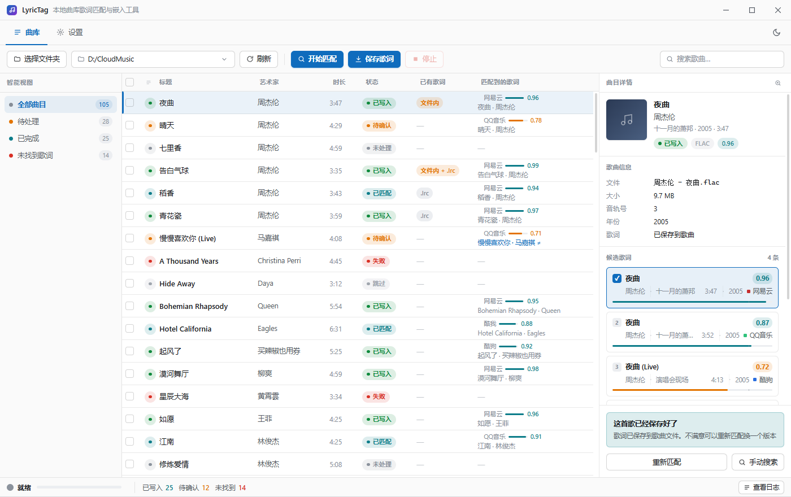
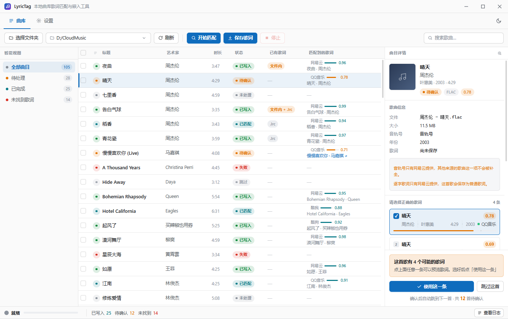
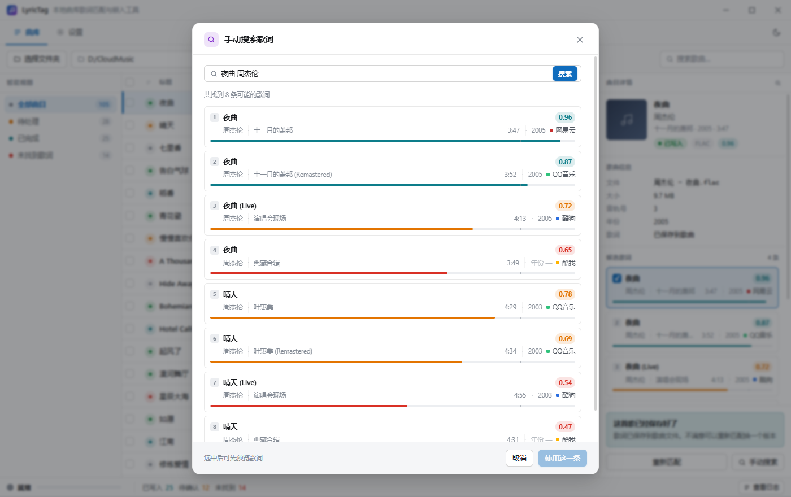
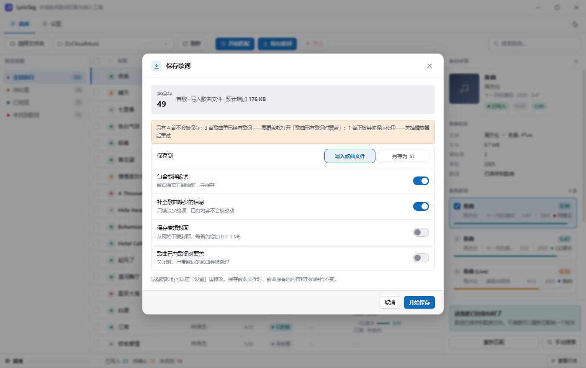
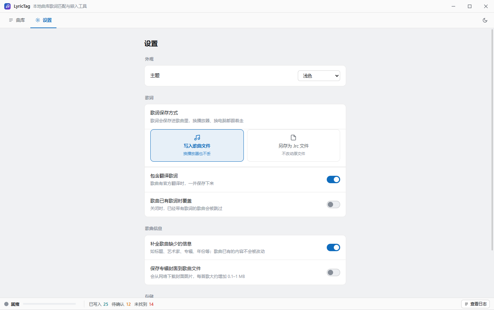

# LyricTag

**本地曲库歌词匹配与嵌入工具** —— 扫描本地音乐文件夹，从四个平台匹配歌词，
把歌词**直接写进歌曲文件内部**（不是旁挂 `.lrc`），并顺带补齐缺失的歌曲信息。



你的本地曲库里可能躺着几百上千首歌，播放器却什么都不显示。歌词要么根本没有，
要么散成一堆 `.lrc` 文件、换个播放器就丢。LyricTag 做三件事：**扫描文件夹 → 匹配歌词 → 写进歌曲文件**。
因为歌词存在文件内部，换播放器、换电脑、拷进手机，歌词都跟着走。

- 🎵 **不依赖任何账号**：四个平台全部走匿名接口，不需要登录、不需要填任何凭证
- 🔍 **不静默错配**：先匹配、给你看结果，再写文件；拿不准的进「待确认」队列
- 📦 **1.99 MB 安装包**：不内置 ffmpeg、不带运行时，装完即用
- 🔒 **全本地运行**：除歌词源请求外无任何外发流量，无遥测

> 仅面向**个人本地使用**。四个平台的接口均为非官方接口，歌词版权归词作者与平台所有；
> 本工具只做「从用户已有的合法访问路径获取并整理」。

---

## 目录

- [界面截图](#界面截图)
- [功能](#功能)
- [使用说明](#使用说明)
- [技术栈](#技术栈)
- [开发](#开发)
- [设计取舍](#设计取舍对设计文档的偏离)
- [已知限制](#已知限制)
- [许可与合规](#许可与合规)

---

## 界面截图

### 曲库主界面

左栏智能视图、中栏歌曲列表（虚拟滚动）、右栏曲目详情。列表同时回答两个问题：
「我们做到哪一步」（状态列）和「文件本来是什么样」（已有歌词列）。


### 人工复核「待确认」的歌曲

评分拿不准的歌曲不会自动写入，而是落到「待确认」，由你从多平台候选中挑一条。
带有 `≠` 标记的候选说明它与歌曲本地信息不一致，需要留意。



### 手动搜索

自动匹配找不到时，用歌名 + 艺术家手动搜。四个平台的结果混在一个列表里，
按评分排序，可以先预览歌词再决定。



### 保存前的确认

点「保存歌词」不会立刻动手 —— 先告诉你要写多少首、体积会增加多少、
哪些会被跳过以及跳过原因。保存选项也能在这里临时改。



### 设置

设置页只有 6 项 + 1 个动作，且不出现任何技术名词。



### 深色主题


---

## 功能

### 歌词写进歌曲文件，不是旁挂 `.lrc`

这是 LyricTag 与大多数歌词下载工具的核心区别。歌词按容器格式写进它该在的位置：

| 格式 | 写入位置 |
|---|---|
| MP3 | ID3v2 `USLT` |
| FLAC / OGG / Opus | Vorbis Comment `LYRICS` |
| M4A / MP4 | `©lyr` atom |
| APE / WavPack | APEv2 |
| WAV / AIFF | ID3v2 chunk |

写入过程**只动标签，不碰音频流**。对副本执行写入后逐字节核对的结果：

| 项 | 结果 |
|---|---|
| 音频流 `mdat` | **字节完全一致**（大小与 BLAKE2b 摘要都相同） |
| 文件体积变化 | +3,302 / +3,530 字节（≈ 歌词字节数，额外开销 < 100 B） |
| 原有封面 `covr` | **保留** |
| 写后回读校验 | 通过（比对内容而非仅判断是否存在） |

不想动音频文件？设置里可以改成 **「另存为 `.lrc` 文件」**，此时音频文件大小完全不变，
只生成同目录下的 UTF-8(BOM) 同名 `.lrc`（BOM 是为了兼容老旧播放器）。

### 四个平台并行检索 + 统一评分

网易云 / QQ音乐 / 酷狗 / 酷我 同时检索，结果归一到同一套评分体系后排序取优。
**全部使用匿名接口**，无需登录或填写凭证 —— 这也意味着产品不必处理凭证存储、失效、泄露这一整类问题。

provider 是插件式的，单源失效不影响其余三个；网易云、QQ 都已备了多条链路降级。

### 两步式流程：先匹配，后写入

匹配**不改动任何文件**。你可以先通览结果，只挑有问题的去处理，确认无误再点「保存歌词」。
低于置信阈值的曲目不会被自动写入，而是进入「待确认」队列 —— 这是对同类工具
「静默错配」缺陷的直接修正。

### 元信息四级降级链

本地曲库的标签质量参差不齐，这是匹配失败的头号原因。文件名也能救场：

```
L1  容器标签            confidence 0.9–1.0
L2  文件名正则（多套模板）  confidence 0.7–0.85
L3  目录结构推断         confidence 0.6–0.75
L4  文件名作标题兜底      confidence 0.4
```

检索前会统一做归一化：全角转半角、剥离 `(Live)` `[Remastered]` 等包裹内容、
**繁 → 简**、拆解 `feat.`、统一多艺人分隔符。没有繁简转换这一步，
繁体标题在大陆平台上基本搜不到东西。

### 顺带补齐歌曲信息

从匹配到的曲目回写**标题 / 艺术家 / 专辑 / 音轨号 / 年份**，
**只填空白字段，绝不覆盖已有值**。「年份」这类字段若平台本身不提供，
界面会明确标注「年份 —」，而不是假装有。

### 专辑封面嵌入

可选。平台封面直接写进歌曲文件内部（与歌词同处），且**仅当文件内没有封面时**才写。
这是唯一有真实带宽成本的一项，默认关闭。

### 翻译 / 逐字歌词自动降级

- **翻译歌词**：歌曲有官方翻译时一并保存（来自网易云 / QQ）
- **逐字歌词**：仅网易云的 YRC 匿名可取，自动降级为普通歌词并在界面上说明原因

两者都无需配置，按平台能力自动处理。

### 不重复劳动：三种列表保护

| 保护 | 说明 |
|---|---|
| **「已有歌词」列** | 动手之前文件里已经有什么（`文件内` / `.lrc` / 两者都有）。没有它，你没法一眼看出哪些歌本来就带歌词 |
| **「歌曲已有歌词时覆盖」开关** | 默认关。关闭时，**歌曲文件里**已有歌词的会被跳过；旁边的 `.lrc` 不算——写文件不会碰它 |
| **文件占用检测** | 歌曲正被播放器占用时不会硬写，明确告知「关掉播放器后重试」 |

### 其他

- **界面**：智能视图分组（全部 / 待处理 / 已完成 / 未找到歌词）、多列排序、实时搜索、
  全选与批量操作条、虚拟滚动（1 万行不卡）、深色主题、日志抽屉
- **鲁棒性**：单曲失败不影响整批；支持中途停止；曲库状态**每个任务结束时落盘**，比「退出时存一次」更抗崩溃
- **缓存**：歌词按条缓存（默认上限 128 MB），重复运行不重复请求网络
- **格式诚实**：遇到 WMA / DSF / DFF 等不支持的格式提前失败并跳过，
  计入结果、不弹窗、不让你去配置 —— **绝不半写**

---

## 使用说明

### 运行环境

- Windows 10 1809+ / Windows 11（x64）
- 需要 WebView2 Runtime（Win11 内置；Win10 需 Evergreen Runtime，安装包会自动引导）

### 安装

从安装包安装即可（NSIS，1.99 MB），无需任何运行时或额外依赖。

### 三步走

```
① 选择文件夹  →  ② 开始匹配  →  ③ 保存歌词
```

1. **选择文件夹**：点工具栏左侧按钮，或直接把文件夹拖到窗口上。
   路径框右侧的小箭头是**最近用过的目录**（最多 8 个），点开直接挑一个，不用再走一遍系统选择框。
2. **开始匹配**：四个平台并行检索。这一步不改动任何文件，可以反复跑。
3. **保存歌词**：先弹出确认框告诉你将保存多少首、体积增加多少、哪些会被跳过。
   确认后才真正写文件。

「保存歌词」在不勾选任何歌曲时，作用于**全部已匹配的歌曲**（不跟随当前筛选与搜索）；
勾选之后只作用于勾选的那些。

工具栏的**刷新**用于在软件之外增删过歌曲的情况：清空列表后重新读取当前文件夹。

### 拿到拿不准的歌曲怎么办

「待确认」的歌曲会出现在列表里（黄色状态点）。选中它，右栏会列出多个平台的候选：

- 点任意一条候选即可**预览歌词**
- 选好后点「使用这一条」，确认后自动跳到下一首待确认歌曲
- 都不满意时点「跳过这首」，它会落到「跳过」状态、不再进入保存集合
- 自动匹配完全失败时，点右栏标题栏的 🔍 手动搜索

### 设置项

匹配阈值、歌词源、歌词格式、元信息规则、网络、并发……**全部内部化，界面上不出现任何技术名词**。
设置页只有 6 项 + 1 个动作：

| 设置 | 默认 | 说明 |
|---|---|---|
| 主题 | 跟随系统 | 跟随系统 / 浅色 / 深色 |
| 歌词保存方式 | 写入歌曲文件 | 或「另存为 `.lrc`」——后者完全不碰音频文件 |
| 包含翻译歌词 | 开 | 歌曲有官方翻译时一并保存 |
| 歌曲已有歌词时覆盖 | 关 | 关闭时，**歌曲文件里**已经有歌词的会被跳过 |
| 补全歌曲缺少的信息 | 开 | **只填空白字段，绝不覆盖已有值** |
| 保存专辑封面到歌曲文件 | 关 | 会从网络下载封面，每首约增加 0.1–1 MB |
| 清空歌词缓存 | — | 已写入歌曲的不受影响 |

### 快捷键

| 按键 | 作用 |
|---|---|
| `Ctrl + F` | 聚焦搜索框 |
| `Ctrl + D` | 切换深色 / 浅色主题 |
| 拖拽文件夹到窗口 | 扫描该文件夹 |

### 支持的格式

| 结果 | 格式 |
|---|---|
| ✅ 可写歌词 | MP3 · FLAC · M4A/MP4/M4B · OGG · Opus · WAV · AIFF · APE · WavPack |
| ⚠️ 仅「另存为 `.lrc`」可用 | WMA / ASF · DSF · DFF —— 不受格式限制，因为不动音频文件 |

### 数据存放位置

```
%APPDATA%/LyricTag/
├── config.toml        用户设置
├── library.index      曲库状态（每个任务结束时落盘）
├── cache/             歌词缓存（默认上限 128 MB）
└── logs/              结构化日志
```

---

## 技术栈

| 层 | 选型 | 说明 |
|---|---|---|
| 桌面框架 | **Tauri 2** | 复用系统 WebView2，安装包 1.99 MB（Electron 方案通常 60 MB+） |
| 后端 | **Rust 2021**（rust-version 1.77） | 全部业务逻辑 |
| 前端 | **原生 TypeScript**，无框架、无打包器 | `tsc` 只做 `.ts → .js`，HTML/CSS 原样拷贝，产物是纯静态文件 |
| 标签读写 | **lofty** | 覆盖 ffmpeg 能写歌词的全部主流格式，且额外支持 APE |
| 网络 | **reqwest** + rustls | 走 ring 后端，免除 OpenSSL 依赖 |
| 异步 / 并发 | **tokio** + **rayon** | 默认 4 路并发，每平台独立限流 |
| 其他 | walkdir · strsim · regex · fast2s · blake3 · tracing | 扫描、相似度、繁简转换、校验、日志 |

**体积控制**：release profile 启用 `lto = "fat"` + `codegen-units = 1` + `panic = "abort"`
+ `strip` + `opt-level = "s"`，实测把这部分从 7.90 MB 压到 2.81 MB（−64%）。

**不引入 ffmpeg**：lofty 已覆盖 ffmpeg 能写歌词的全部主流格式（还多一个 APE），
而 ffmpeg 写同一个文件的耗时是 lofty 的 30–80 倍。详见设计文档 §4.4.2。

---

## 开发

### 快速开始

```bash
# 1. 装前端依赖（只有 typescript 与 tauri cli）
npm install

# 2. 编译前端（tsc + 静态资源拷贝，没有打包器）
npm run build

# 3. 跑起来
cd src-tauri && cargo run --release
```

或者一次性打包成安装包：

```bash
npx tauri build          # 产物在 src-tauri/target/release/bundle/nsis/
```

### 目录结构

```
src/                    前端（原生 TypeScript，无框架、无打包器）
  index.html            界面骨架（由设计原型逐块移植）
  styles.css            设计令牌 + 全部样式（由原型 CSS 提取，保证视觉一致）
  main.ts               入口：连线、事件、启动流程
  tauri.ts              Tauri 通信桥接（~80 行，零依赖）
  types.ts              与 Rust DTO 逐字段对应的类型契约
  store.ts              前端状态 + 本地过滤/排序
  dom.ts                DOM 与格式化工具
  ui/                   表格（虚拟滚动）、详情面板、弹窗、状态栏、最近目录下拉
  views/settings.ts     设置页

src-tauri/src/          后端
  lib.rs                应用装配与日志
  state.rs              AppState + Tauri 事件出口
  cmd/                  Tauri Command 边界层（薄）：参数校验、DTO 转换、错误映射
  domain/               纯领域模型与算法（无 IO、无异步）—— 评分、归一化
  pipeline/             编排：扫描 → 匹配 → 下载 → 写入 + 曲库状态持久化
  provider/             四个歌词源适配（网易云 / QQ / 酷狗 / 酷我）
  tag/                  标签读写（lofty）、格式能力判定、文件占用检测
  lrc/                  歌词解析 / 时间轴合并 / 逐字降级 / 渲染
  infra/                http · ratelimit · config · events · paths · error

scripts/
  copy-static.mjs       静态资源拷贝
  preview.mjs           开发预览：套一层假后端跑真实界面
  preview-stub.js       假后端数据与场景钩子
  preview-serve.mjs     预览用的静态服务器

src-tauri/src/bin/lyrictag-cli.rs
                        命令行验证工具（见下）
```


---

## 许可与合规

- 四个平台的接口协议是实现事实，代码为独立实现。
- 歌词版权归词作者与平台，本工具不内置任何内容分发能力。
- 仅供个人学习与研究使用
